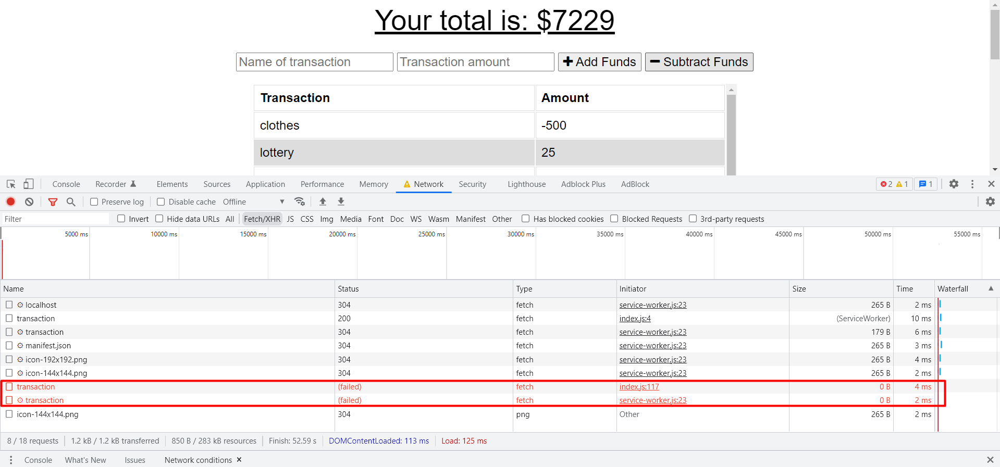
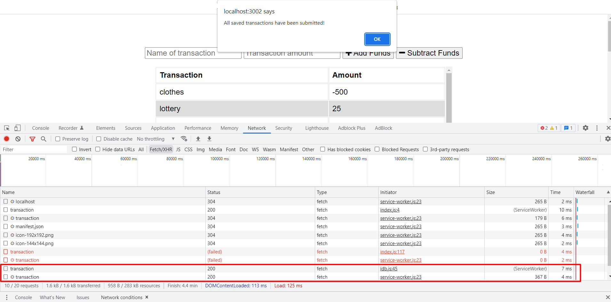
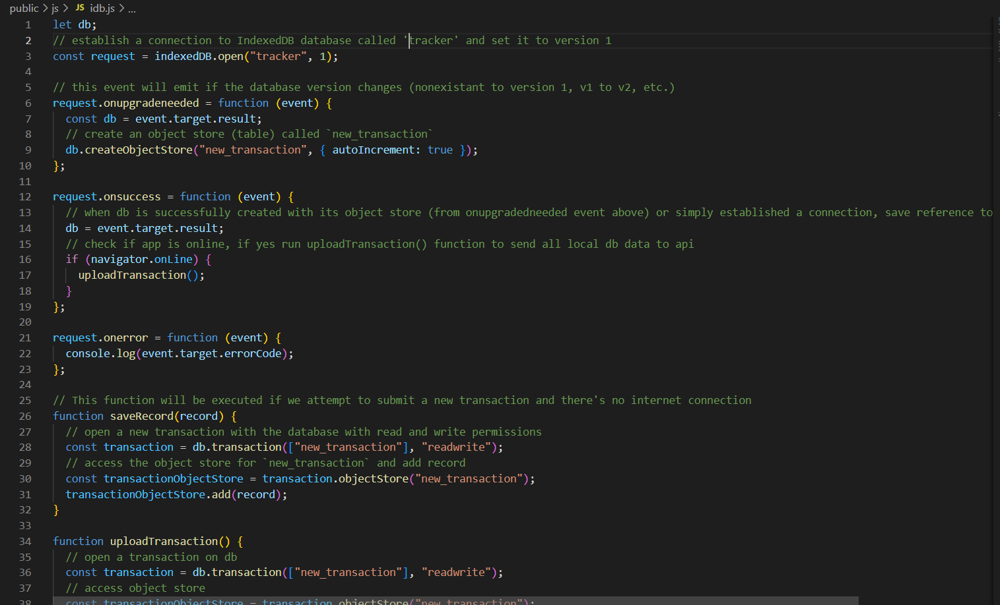
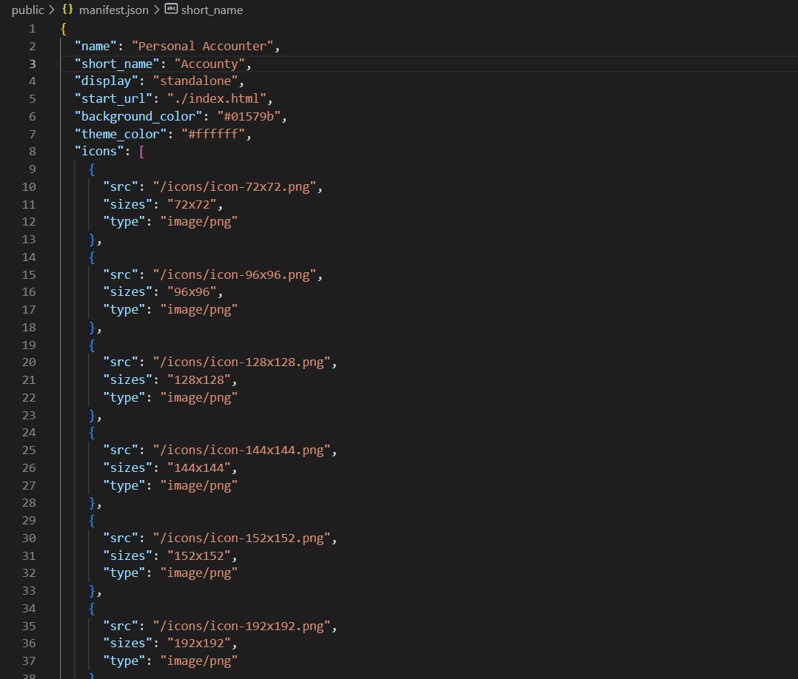
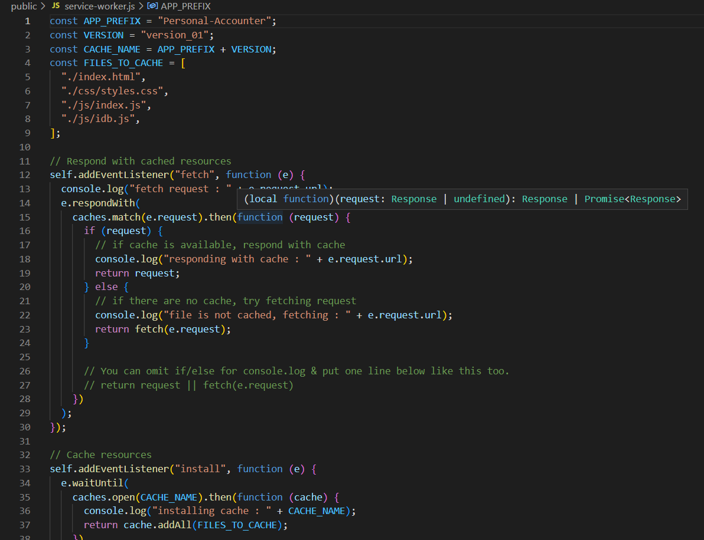

# personal-accounter-pwa

        

## Table of Contents
- [Description](#description)
- [Installation](#installation)
- [Usage](#usage)
- [Questions](#questions)
- [License](#license)  
        

## Description

This app make the user be able to track my withdrawals and deposits with or without a data/internet connection. And by that it's make account balance is accurate in traveling 

Budget Tracker is an application that allows users to update their finances. More importantly, this is Progressive Web Application which is improving runtimes, providing offline capabilities, and making a downloadable application. These are cutting-edge improvements that will greatly increase the quality of user experience. 

## Installation

Links to the repository and the deployed page can be found at [Questions](#questions).

While this project's repository is available on Github, the page is deployed to heroku. If you clone the repo you must run the command "npm install" on the Terminal/Command Line and download the dependencies. 

## Usage

Once the project is cloned and the dependencies downloaded, type "npm start" to run the program. 

A screenshot site offline and then online are shown, displaying the offline functionality of the program.

Screenshots of the idb.js, manifest.json, and service-worker.js files are below:

## Questions

The github repository to this project is below:

[https://github.com/sergiionyx/personal-accounter-pwa.git](https://github.com/sergiionyx/personal-accounter-pwa.git)

The live website is deployed on heroku. The URL is below:

[https://radiant-headland-82458.herokuapp.com/](https://radiant-headland-82458.herokuapp.com/)

For any additional questions, I can be reached at the following:

Sergii Onyshchenko: twilight.cympak@gmail.com@gmail.com
Github: [https://github.com/sergiionyx](https://github.com/sergiionyx)

## License

[view license link here](https://choosealicense.com/licenses/mit/)

        
MIT License

Copyright (c) [2022] [sergiionyx]

Permission is hereby granted, free of charge, to any person obtaining a copy
of this software and associated documentation files (the "Software"), to deal
in the Software without restriction, including without limitation the rights
to use, copy, modify, merge, publish, distribute, sublicense, and/or sell
copies of the Software, and to permit persons to whom the Software is
furnished to do so, subject to the following conditions:

The above copyright notice and this permission notice shall be included in all
copies or substantial portions of the Software.

THE SOFTWARE IS PROVIDED "AS IS", WITHOUT WARRANTY OF ANY KIND, EXPRESS OR
IMPLIED, INCLUDING BUT NOT LIMITED TO THE WARRANTIES OF MERCHANTABILITY,
FITNESS FOR A PARTICULAR PURPOSE AND NONINFRINGEMENT. IN NO EVENT SHALL THE
AUTHORS OR COPYRIGHT HOLDERS BE LIABLE FOR ANY CLAIM, DAMAGES OR OTHER
LIABILITY, WHETHER IN AN ACTION OF CONTRACT, TORT OR OTHERWISE, ARISING FROM,
OUT OF OR IN CONNECTION WITH THE SOFTWARE OR THE USE OR OTHER DEALINGS IN THE
SOFTWARE.